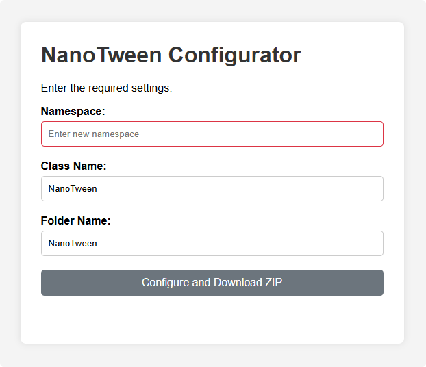

# NanoTween - embedded tweening system.

A tweening system designed to be embedded in third-party assets. There can be any number of copies, as long as the namespaces and assemblies in which they are embedded are different.

> ⚠️ Not recommended for use in non-distributed projects, only in distribution assets. Use other alternatives that have better usability and performance.

## Requirements

* Unity 2022.2 or later

## Configuration and downloading

Click on the button below to go to the page to configure a custom NanoTween.

[](https://hoshiza.github.io/NanoTween/configurator/)

## Installation

1. Use the button above or the link in repository about to open the configuration page.
2. Using the form, enter the data you need and download the archive. 
3. Copy the `NanoTween` folder to your asset directory.

## Usage

Easy to create tweens using builder.

```cs
Image image = GetComponent<Image>();

var builder = image.CreateTween(from: Color.white, to: Color.black, duration: 2f)
    .From(() => image.color) // Uses the passed getter at startup time after the delay.
    .To(Color.black) // Uses the passed value when creating a tween.
    // With Prefix is used for configuration.
    .WithDelay(2f) // Creates a delay before execution.
    .WithLoops(2, NLoopType.Yoyo, affectOnDuration: true) // Creates a Loop with the passed parameters.
    .WithTimeKind(TimeKind.UnscaledTime) // Sets the update time.
    .WithEase(EaseFunction.InOutSine) // Sets Ease.
    .WithPlaybackSpeed(2f) // Sets the Playback Speed.
    // On Prefix is used for callbacks.
    .OnStart(() => { /* Logic */ }) // Called during startup.
    .OnStartDelayed(() => { /* Logic */ }) // Called during the actual startup, taking into account the delay.
    .OnComplete(() => { /* Logic */ }) // Called upon completion or cancellation.
    // Other methods not related to creation.
    .Preserve(); // Does not invoke Dispose for the builder. Allows to reuse the builder.

// Run the tween with the passed parameters:
// target - MonoBehaviour, which is used to start the coroutine.
// action - Action<T, TTarget>, used to set values during interpolation.
var handle = builder.Run(target: image, action: static (v, target) => target.color = v);

builder.Dispose(); // Don't forget to call Dispose after use if the builder has called Preserve().
```

## License

This project is licensed under the [MIT License](LICENSE).
